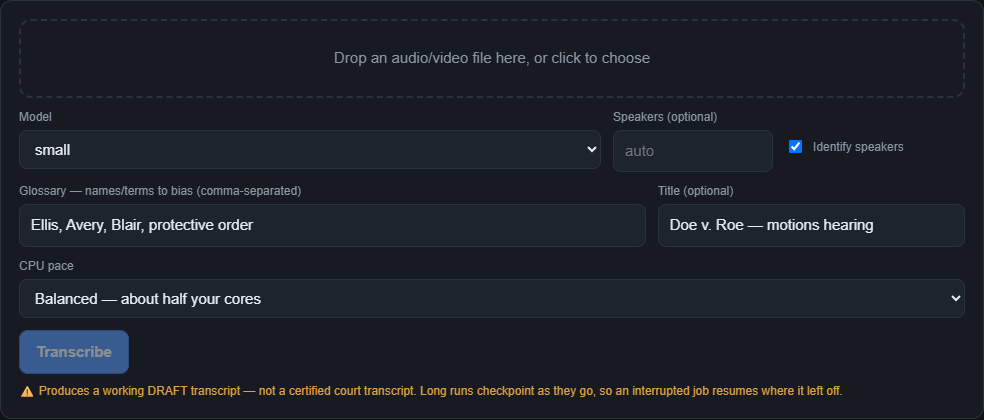
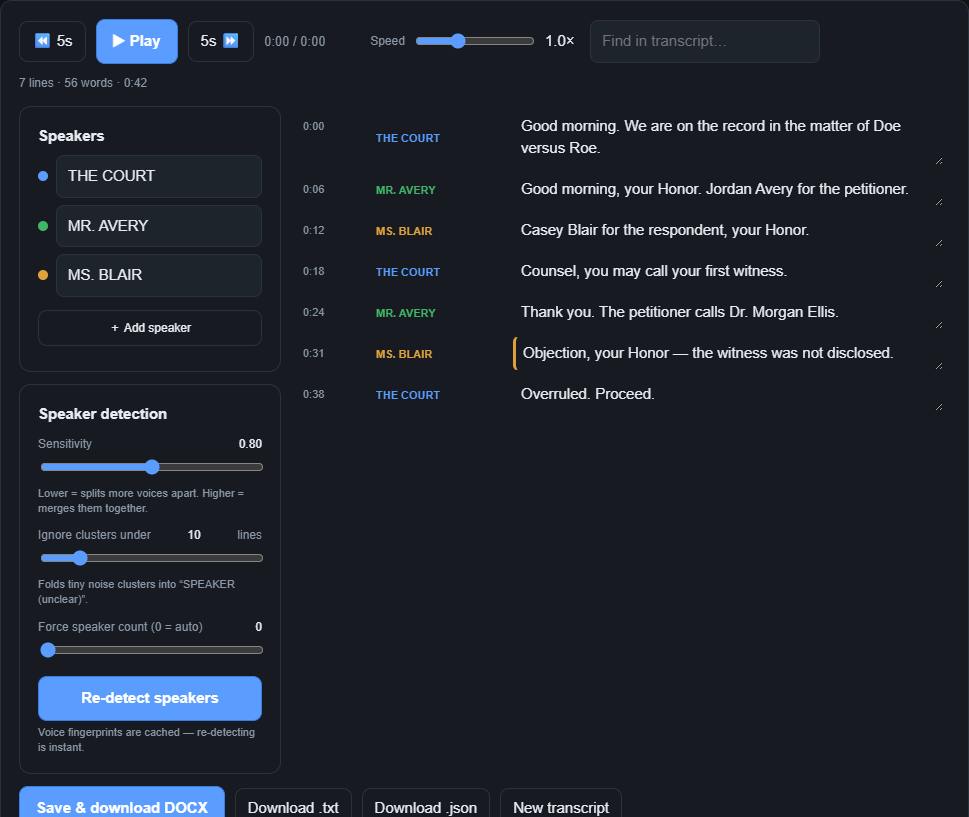

# Transcript Genie

**Local-first, court-quality transcript generator for courtroom & legal audio.**

Transcript Genie turns courtroom recordings — starting with **CourtSmart / FTR
digital-recording discs** (multichannel OGG audio + a clerk-authored
`Sessions.csx` log) and any generic audio/video file — into **speaker-labeled,
court-formatted transcripts** you can review and export to DOCX. Speech-to-text
runs **fully offline by default** (faster-whisper); speaker attribution comes
from the clerk log and/or acoustic diarization.

> ⚠️ **Draft, not certified.** Transcript Genie produces a high-quality
> **working/draft transcript** for review, case preparation, and appeal
> support. It is **not** a certified transcript and has not been reviewed by an
> approved court transcriber. Every generated document is labeled accordingly.

---

## Screenshots

**Drop in a file, pick your options, and transcribe — everything on your machine:**



**Review desk — synced audio playback, per-line speaker dropdowns, live
diarization tuning, low-confidence flags, and one-click DOCX / TXT / JSON export:**



> A full step-by-step walkthrough (with these screens) is in **[docs/GUIDE.md](docs/GUIDE.md)**.

## Why it exists

Ordering an official transcript is slow and expensive, and generic transcription
tools don't understand courtroom structure. Transcript Genie is purpose-built:

- It reads the **CourtSmart clerk log** to recover the case caption, judge, date,
  and speaker/section timeline — attribution no generic transcriber has.
- It renders output in the **official court format** (Courier, double-spaced,
  1–25 line numbering, caption page, colloquy, certification).
- It runs **on your machine** — confidential audio never leaves the device.

## Features

**Ingest**
- **CourtSmart / FTR disc import** — parses `Sessions.csx`, stitches the OGG
  segments, and pulls case metadata + the clerk's speaker/section timeline.
- **Generic audio/video** — transcribe any `mp3` / `wav` / `m4a` / `mp4` /
  `flac` / `ogg` file (via ffmpeg).
- **Folder of loose files** — stitch a directory of clips into one transcript.

**Transcription**
- **Local ASR** — faster-whisper with word timestamps, confidence, and a custom
  glossary for proper names/legal terms. Runs offline. (Cloud ASR is a planned opt-in.)
- **Parallel + pacing** — split long recordings across worker processes; choose
  **Aggressive / Balanced / Background** CPU pace (Background runs at low priority
  so your machine stays usable).
- **Resumable** — long runs checkpoint as they go; an interrupted job resumes
  where it left off.

**Speaker attribution**
- **Clerk-log alignment** for CourtSmart, plus optional **ECAPA acoustic
  diarization** that corrects sparse/mistimed log tags.
- **Live re-tuning** — voice fingerprints are cached, so re-detecting speakers
  with new sensitivity / min-cluster / speaker-count settings is *instant*.
- **Per-line reassignment** — fix a single misattributed line from a dropdown;
  add a speaker by hand; rename a speaker once and it updates everywhere.

**Review & output**
- **Review desk** (web GUI) — synced audio with click-to-seek, playback speed
  (0.5–2×), ±5s skip, keyboard shortcuts, find-in-transcript, per-line
  timestamps, speaker color-coding, and **low-confidence highlighting** so you
  know exactly what to verify against the audio.
- **Court-format DOCX** — caption title page, line-numbered colloquy, examination
  headers, event parentheticals, DRAFT certification page.
- **Multiple exports** — court DOCX, plain **TXT**, and structured **JSON**
  (segments, words, timestamps, confidence, speakers) for downstream tooling.
- **Multi-session combine** — merge several hearing sessions into one master
  transcript with section markers.

**Distribution**
- **Standalone installers** for Windows, macOS, and Linux, published on every
  release, plus a `pip`/`pipx` package.
- **Self-updating** — the app checks GitHub Releases for a newer build.

## Status

| Area | State |
|---|---|
| CourtSmart disc → court-format DOCX/JSON | ✅ working |
| Generic audio + acoustic speaker diarization | ✅ working |
| Web GUI review desk (playback, tuning, per-line edits, export) | ✅ working (`transcript-genie-web`) |
| Standalone installers (Windows / macOS / Linux) via GitHub Releases | ✅ published by CI |
| Self-update check against GitHub Releases | ✅ working |
| Packaged Electron desktop app (`.dmg` / `.exe` installer, signed) | 🚧 planned |
| Cloud ASR option, PDF / SRT / VTT export | 🚧 planned |

## Download

Grab a build from the [Releases](../../releases) page. Each push to `main`
refreshes a rolling **`latest`** pre-release; tagged `v*` builds are the stable
releases. Every release carries:

- **Standalone binary** — `transcript-genie-windows-x64.exe`,
  `transcript-genie-macos-arm64`, or `transcript-genie-linux-x64`. No Python needed;
  core transcription. Requires **ffmpeg** on your `PATH`. (Acoustic diarization needs
  the Python package below.)
- **Python package** — `pipx install transcript_genie-<version>-py3-none-any.whl`, or
  `pip install "transcript-genie[diarize]"` for acoustic speaker diarization.

> macOS: the binary is unsigned — the first run may need right-click → **Open** (or
> `xattr -d com.apple.quarantine transcript-genie-macos-arm64`).

## Requirements

- **Python 3.11 or 3.12** (ctranslate2/faster-whisper wheels aren't published for
  3.13+ yet). *Not needed if you use a standalone binary.*
- **ffmpeg** on your `PATH`.
- Optional (for acoustic diarization): PyTorch + SpeechBrain (`[diarize]` extra).

## Install (from source)

```bash
git clone <your-repo-url> transcript-genie
cd transcript-genie
python -m venv .venv
# Windows:  .venv\Scripts\activate     macOS/Linux:  source .venv/bin/activate
pip install -e ".[dev]"          # core + tests
pip install -e ".[web]"          # local review-desk GUI
pip install -e ".[diarize]"      # optional: acoustic speaker diarization
```

## Usage

### Web GUI (recommended)

A local, browser-based review desk (no cloud): drop in an audio/video file, watch
it transcribe, review with synced audio playback, tune speaker detection, fix
attribution line by line, and export.

```bash
pip install -e ".[web]"     # or:  pip install "transcript-genie[web]"
transcript-genie-web        # serves http://127.0.0.1:8756 and opens your browser
```

See **[docs/GUIDE.md](docs/GUIDE.md)** for the full walkthrough.

### CLI

```bash
# CourtSmart / FTR disc (a folder containing Sessions.csx):
transcript-genie "E:/" --out-dir ./out --model small \
  --glossary "Smith, Doe, protective order"

# Any audio/video file, with automatic speaker diarization, using all cores:
transcript-genie ./hearing.mp3 --out-dir ./out --model medium --speakers 3 \
  --pace aggressive
```

Outputs `transcript.json` and `transcript.docx` in `--out-dir`.

| Flag | Purpose |
|---|---|
| `--model` | faster-whisper model: `tiny` … `large-v3` (default `small`) |
| `--glossary` | comma-separated proper names / legal terms to bias ASR |
| `--diarize` / `--no-diarize` | acoustic speaker diarization (generic audio) |
| `--speakers N` | fix the number of speakers, if known |
| `--refine` / `--no-refine` | CourtSmart: correct clerk-log speaker drift acoustically |
| `--trim` / `--no-trim` | CourtSmart: trim to the target case on a multi-case disc |
| `--roster FILE` | JSON `{speaker_id: label}` roster override |
| `--pace` | `aggressive` / `balanced` / `background` CPU usage |
| `--jobs N` | explicit parallel worker count (overridden by `--pace`) |
| `--case-name` / `--case-number` / `--court` / `--judge` / `--date` | caption overrides |
| `--title` | document title for generic audio (defaults to filename) |
| `--ffmpeg PATH` | path to the ffmpeg binary |
| `--check-update` | check GitHub for a newer release |
| `--version` | print version and exit |

## How it works

```
CourtSmart disc / media file
        │
  ┌─────▼─────┐   ┌──────────┐   ┌───────────────┐   ┌──────────────┐   ┌────────────┐
  │  csx /    │──▶│  media   │──▶│      asr      │──▶│    align /   │──▶│  court_docx │
  │  decode   │   │ (ffmpeg) │   │(faster-whisper)│  │  diarize     │   │  → DOCX/JSON│
  └───────────┘   └──────────┘   └───────────────┘   └──────────────┘   └────────────┘
   parse log &    stitch/downmix   local transcription  speaker + case    official-style
   metadata       to mono WAV      + word confidence    attribution       formatting
```

Each module is small, single-responsibility, and independently tested.

## Development

```bash
pip install -e ".[dev]"
pytest -q
```

Tests cover the CSX parser, media stitching, ASR mapping, alignment/case
extraction, court DOCX formatting, diarization clustering, parallel/resume,
multi-session combine, the web endpoints, and the update check.

## Roadmap

See [`docs/superpowers/specs`](docs/superpowers/specs) for the design and
[`docs/superpowers/plans`](docs/superpowers/plans) for implementation plans.
Next: a packaged Electron desktop app (signed `.dmg` / `.exe` installers wrapping
the review desk), a cloud-ASR opt-in, and additional export formats (PDF / SRT / VTT).

## Acknowledgments

Built on [faster-whisper](https://github.com/SYSTRAN/faster-whisper),
[SpeechBrain](https://speechbrain.github.io/),
[python-docx](https://python-docx.readthedocs.io/), and
[ffmpeg](https://ffmpeg.org/).

## License

[MIT](LICENSE) © 2026 the Transcript Genie authors
